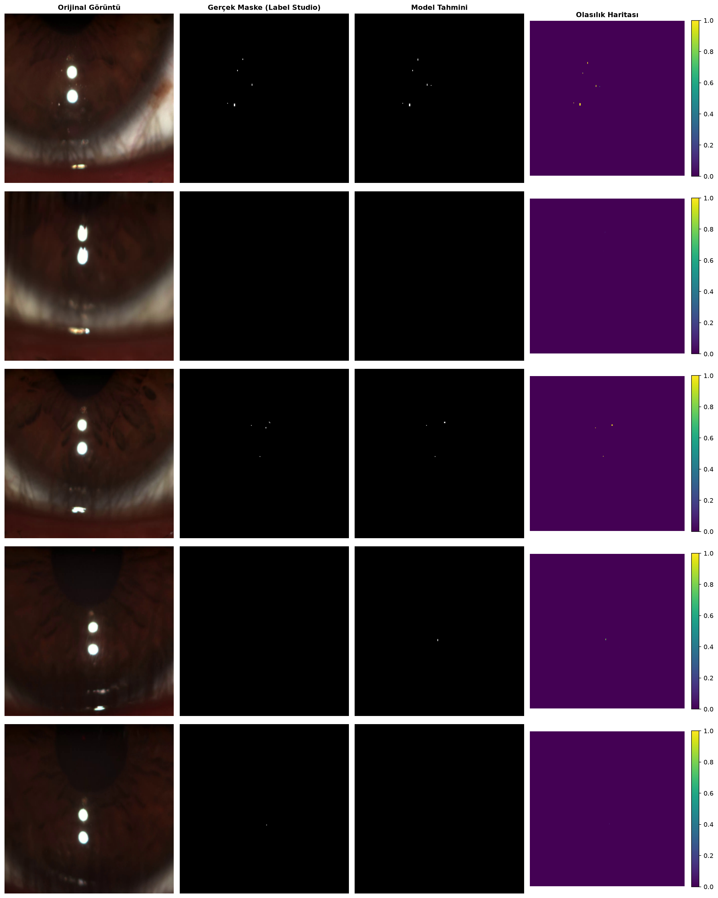

# Advanced Tear Film Analysis

Python computer-vision pipeline for **tear-film particle tracking**, **blink-aware epoch segmentation**, **U-Net deep-learning segmentation**, and **clinical dynamics reporting**. Inspired by the PTLib reference and literature on corneal reflective particle spread (*Tracking the Reflective Light Particles Spreading on the Cornea*).



---

## What This Project Does

Tear-film dynamics are studied by tracking bright particles in high-speed eye videos after a blink. Raw analysis is noisy: blinks, fixation glare, and weak contrast make simple thresholding unreliable.

This system provides **two complementary pipelines**:

| Pipeline | Method | Best for |
| -------- | ------ | -------- |
| **Classic** | Adaptive bandpass + glare mask + greedy tracking | Parameter tuning, FWHM metrics, validation grid search |
| **U-Net** | Trained segmentation (`unet_tear_film.pth`) + centroid tracking | Robust particle masks on challenging frames |

Both pipelines share:

1. **Blink detection** (robust Z-score) and **open-eye epoch** segmentation  
2. **Safe-frame filtering** (exclude blink intervals)  
3. **MMS velocity** (momentary moving speed) over post-blink time  
4. **Medical report**: power-law fit \( \mathrm{MMS}(t) = \alpha \cdot t^{-\beta} \) with biomarkers **eMMSi** / **eMMSf**  
5. Optional **FDM** (Fixed-Duration Model): first **1 s** after each blink only  

---

## Key Features

| Feature | Description |
| ------- | ----------- |
| **Blink & epochs** | Median/MAD Z-score; padded blink exclusion |
| **Glare exclusion** | Circular buffers around fixation lights |
| **Classic detection** | DoG bandpass + local `thresh_k` / `floor_threshold` |
| **U-Net segmentation** | Label Studio → train → infer → track (`train_unet.py`, `track_particles.py`) |
| **Unified Streamlit UI** | One video upload for all tabs (classic + U-Net) |
| **Power-law & biomarkers** | α, β, eMMSi (t=0.1 s), eMMSf (t=2.0 s), R² |
| **FDM analysis** | Sidebar toggle: post-blink first 1 s window |
| **Validation optimizer** | Grid search vs. manual ground truth (F1) |

---

## Project Structure

```
tear_fluid/
├── tear_film_advanced.py   # Classic OOP pipeline
├── tear_film_ui.py         # Streamlit UI (main entry)
├── unet_tracking_tab.py    # U-Net tab (inference + medical report)
├── medical_report.py         # FDM, power-law, biomarkers
├── medical_report_ui.py      # Streamlit medical report widgets
├── track_particles.py        # U-Net video/image tracking CLI
├── train_unet.py             # Label Studio → masks → U-Net training
├── test_unet.py              # Random-frame qualitative test → PNG
├── extract_frames.py         # Sample frames from project videos
├── ui_video.py               # Shared Streamlit video upload
├── veri_analizi.py           # CLI power-law post-processing
├── test.png                  # Example U-Net test output (only tracked image)
├── requirements.txt
├── start_ui.bat              # Windows: launch Streamlit
├── run_analysis.bat          # Windows: classic CLI
├── UI_GUIDE.md               # Streamlit workflow (Turkish)
├── README_ADVANCED.md        # Classic pipeline reference
├── POWER_LAW_ANALYSIS.md     # Decay curve methodology
└── SAFE_FRAME_GUIDE.md       # Safe-frame behavior
```

Local-only (see `.gitignore`): `data/`, videos, `.pth` weights, CSV outputs, generated plots.

---

## Requirements

- Python 3.8+ (3.11 recommended)
- CUDA GPU recommended for U-Net **training** (inference works on CPU)
- OpenCV-compatible video (`.mkv`, `.mp4`, …)

```bash
pip install -r requirements.txt
```

---

## Quick Start

### 1. Streamlit UI (recommended)

```bash
python -m streamlit run tear_film_ui.py
```

Windows: double-click `start_ui.bat`.

**Workflow**

```
Sidebar: upload video → Load Video (blink analysis runs)
Optional: enable FDM (first 1 s after each blink)
Tabs:
  Titration / Blink Detection → classic parameter preview
  Run Analysis → full classic CSV + medical report
  U-Net Gözyaşı Takibi → segmentation + tracking + medical report
  Results → upload classic CSV for power-law charts
```

See [UI_GUIDE.md](UI_GUIDE.md) for the full Turkish walkthrough.

### 2. Classic CLI

```python
from tear_film_advanced import TearFilmConfig, TearFilmAnalyzer

config = TearFilmConfig(
    video_path="path/to/video.mkv",
    output_csv="results.csv",
    show_visualization=False,
)
TearFilmAnalyzer(config).analyze_video()
```

```bash
python tear_film_advanced.py
```

### 3. U-Net pipeline

```bash
# 1) Extract frames (optional, if not already in data/unet_raw_frames/)
python extract_frames.py

# 2) Annotate in Label Studio → export data/annotations.json
# 3) Train (CUDA)
python train_unet.py

# 4) Qualitative check (writes test_sonuclari.png locally — not committed)
python test_unet.py

# 5) Track particles on video or frame folder
python track_particles.py --fps 30 --mm-per-pixel 0.01
```

Model artifact: `unet_tear_film.pth` (generate locally; not in git).

---

## Medical Report (Biomarkers)

Literature model:

\[
\mathrm{MMS}(t) = \alpha \cdot t^{-\beta}
\]

| Biomarker | Formula | Meaning |
| --------- | ------- | ------- |
| **α** | fit parameter | Scale factor |
| **β** | fit parameter | Decay exponent |
| **eMMSi** | \( \alpha \cdot 0.1^{-\beta} \) | Estimated speed at **t = 0.1 s** |
| **eMMSf** | \( \alpha \cdot 2.0^{-\beta} \) | Estimated speed at **t = 2.0 s** |

- **FDM off**: pooled post-blink epochs (excluding epoch starting at frame 0).  
- **FDM on**: only samples with `time_since_blink_s ≤ 1.0` (t=0 = first clear frame after blink).  
- **U-Net speeds**: px/s by default; enter **mm/pixel** in the UI for mm/s.  
- Implementation: `medical_report.py` + `compute_power_law_decay()` in `tear_film_advanced.py`.

---

## Output CSV Columns

### Classic (`Run Analysis`)

| Column | Description |
| ------ | ----------- |
| `time_since_blink_s` | Time since epoch start (post-blink) |
| `include_in_power_law_fit` | Valid for decay fit (0 if epoch starts at frame 0) |
| `epoch`, `particle_id` | Interval and track ID |
| `mms_velocity` | Momentary moving speed (MMS) |
| `x_norm`, `y_norm` | Normalized coordinates |

### U-Net (`track_particles.py` / UI tab)

| Column | Description |
| ------ | ----------- |
| `frame_number`, `time_sec` | Source frame and time |
| `time_since_blink_s` | Added when epochs available (UI) |
| `velocity_px_per_sec` | Speed in px/s |
| `velocity_mm_per_sec` | Speed in mm/s (if calibrated) |

---

## Architecture

**Classic:** `BlinkDetector` → `EpochSegmenter` → `GlareExcluder` → `ParticleDetector` → `ParticleTracker` → `TearFilmAnalyzer`

**U-Net:** `UNet` (`train_unet.py`) → `predict_mask_fullres` → `ParticleTracker` (`track_particles.py`)

**Medical:** `compute_medical_report()` → `scipy.optimize.curve_fit` → UI via `render_medical_report_section()`

---

## Documentation

| Document | Purpose |
| -------- | ------- |
| [UI_GUIDE.md](UI_GUIDE.md) | Streamlit usage (Turkish) |
| [README_ADVANCED.md](README_ADVANCED.md) | Classic parameters & API |
| [INSTALL.md](INSTALL.md) | Setup & Label Studio |
| [POWER_LAW_ANALYSIS.md](POWER_LAW_ANALYSIS.md) | Decay methodology |
| [SAFE_FRAME_GUIDE.md](SAFE_FRAME_GUIDE.md) | Safe-frame selection |

---

## Example Configuration

```python
config = TearFilmConfig(
    video_path="video.mkv",
    blink_z_threshold=4.0,
    blink_pad_frames=3,
    min_epoch_length=5,
    glare_buffer_radius=30,
    thresh_k=3.0,
    output_csv="tear_film_analysis.csv",
)
```

---

## License & Research Use

Research and clinical tooling. Validate on your acquisition setup before publication or diagnostic use.

---

## Acknowledgments

Algorithm design influenced by **PTLib** (JavaScript). Medical decay model aligned with corneal tear-film particle tracking literature. Stack: OpenCV, NumPy, SciPy, PyTorch, Streamlit.

**Version:** 3.0  
**Author:** Tear Film Research Lab
